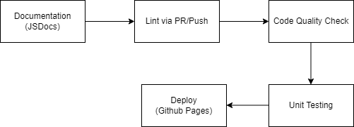

# Phase 1 Pipeline
## Diagram

## Functional 
- Linting 
	- Uses Super linter 
- Documentation
	-  JSDocs
- PR review
## Working on
- Automation of unit testing
	- Uses Jest. Currently still working on being able to create a coverage test file through Github Actions. 
- Code Quality
	-	Uses Code Climate, currently stuck on a bug where PR aren't connected with Code Climate. 
## What's Next?
- Make end to end testing
	- Maybe Github pages
- Issue tracker 
	- this is a "reach" thing, may not get to it.

