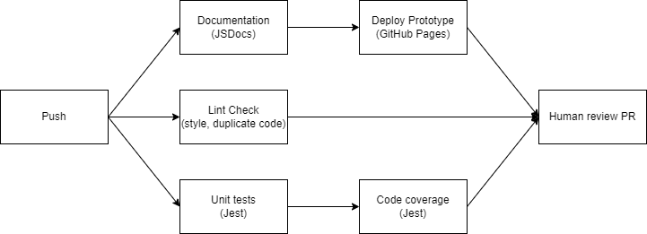

# Phase 2 Pipeline
## Diagram

## Functional 
- Linting 
  - Uses Super linter from GitHub
  - All HTML, CSS, JS and YAML files are checked for style, duplicate code, etc.
- Code Quality
  - Uses Code Climate, currently stuck on a bug where PR aren't connected with Code Climate.
- Documentation
  - JSDocs
  - Classes and functions that are commented with `/**` will be documented through the GitHub page
  - GitHub page organizes documentation better than a Markdown file
  - Includes descriptions, parameters, return values
- Automation of unit testing
  - Jest
  - Both tests and code coverage are recorded
  - Outputs are recorded on GitHub through a bot comment in the PR
- PR review
  - At least one other person must approve the PR
  - All checks must pass, including Jest tests, linting, and code quality checks along with the approval before merging
## What's Next?
- Make end to end testing
	- Build upon the current Jest test suites to test user interaction
- Issue tracker 
	- this is a "reach" thing, may not get to it
