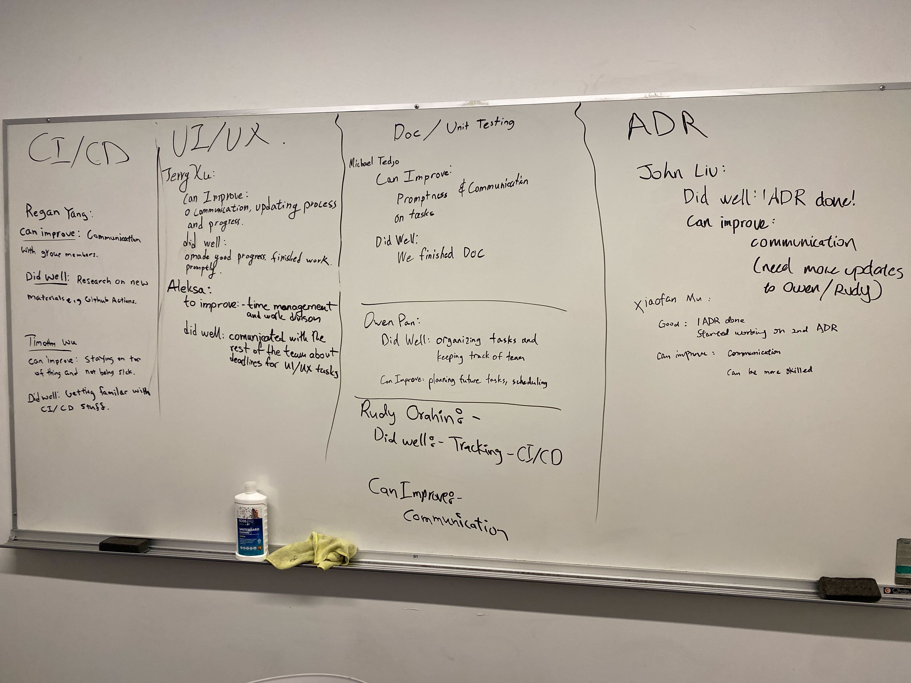

# 11/16/22 - Retrospective

## Time and Location

- at 7:00 PM Wednesday Nov 16th, 2022

## Attendees
- Owen
- Rudy
- Regan
- Aleksa
- Michael
- John
- Xiaofan
- Jerry
- Tim (Remote)

## Retrospective
- Can Improve:
  - Regan: Communication with group members
  - Tim: Staying on top of things and not being sick
  - Jerry: Communication between partners
  - Aleksa: Time Management and Work Division
  - John: Communication to Team Leads
  - Xiaofan: Communication and Skill
  - Michael: Promptness and Communication on tasks between partners and collaborators
  - Owen: planning future tasks, scheduling
  - Rudy: Communication
- Did Well:
  - Regan: Research on new materials
  - Tim: Getting Familiar with CI/CD Stuff
  - Jerry: Made good work, finished work promptly.
  - Aleksa: Communicated with the rest of the team about deadlines for UI/UX tasks
  - John: First ADR Done
  - Xiaofan: ADR Done, 2nd ADR started
  - Michael: Finished Documentation
  - Owen: organizing tasks and keeping track of team
  - Rudy: Tracking/Facilitating - CI/CD

  