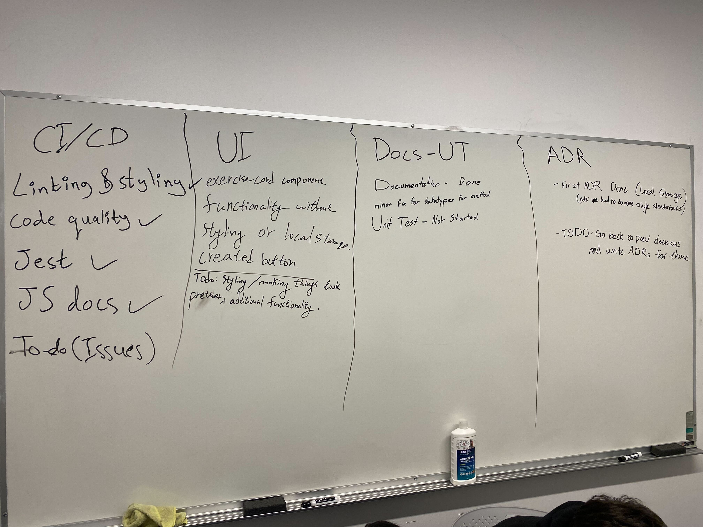
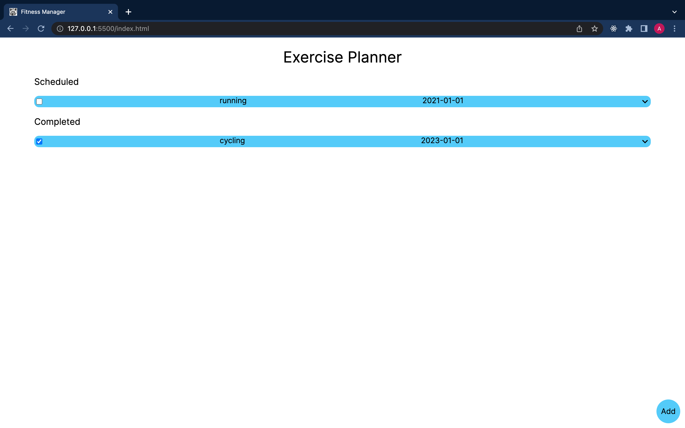
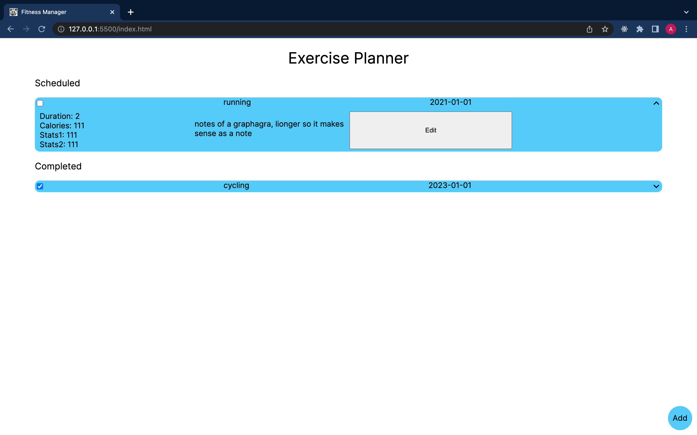

# 11/16/22 - Sprint 1

## Time and Location

- at 6:00 PM Wednesday Nov 16th, 2022

## Attendees
- Owen
- Rudy
- Regan
- Aleksa
- Michael
- John
- Xiaofan
- Jerry
- Tim (Remote)

## Progress Report
- CD/CI
  - Linting and Styling Done
  - Code Quality - Done
  - Jest - Done
  - JS Docs - Done
  - Issue Tracker - Not Started
- UI
  - Exercise Card Functionality - Done
  - Exercise Card Styling - Not Started
  - Initialization Functionality - Done
  - Additional Functionality - Not Started
- Doc/Unit Testing
  - Documentation - Done: Minor fix for datatypes for method
  - Unit Testing - Not Started
- ADR
  - First ADR - Done: Minor formatting/styling tweaks
  - Second/Third ADR - Not Started
- Other
  - Local Storage - Not Started

  
  
  
  