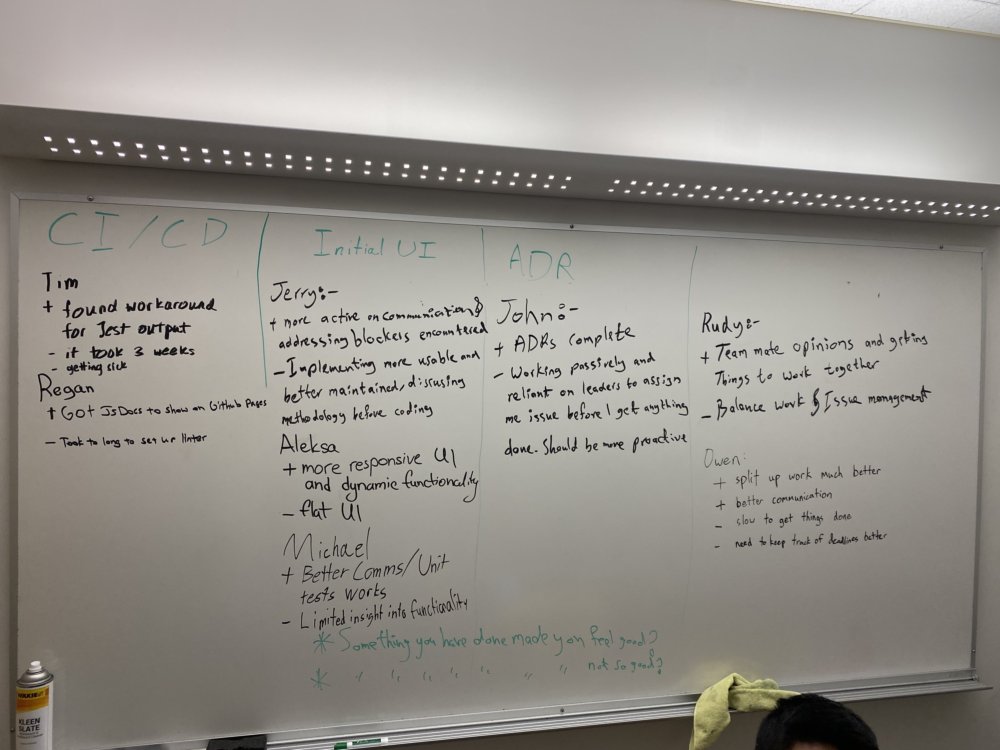

# 11/30/22 - Retrospective 2

## Time and Location

- at 6:45 PM Wednesday Nov 30th, 2022

## Attendees
- Owen
- Rudy
- Regan
- Aleksa
- Michael
- Tim 
- Jerry (Remote)
- John (Remote)

## Retrospective
- Tim
  - Found workaround for Jest Output
  - It took 3 weeks along with getting sick.
- Regan
  - Got JS Docs to show on Github Pages
  - Took too long to set up Linter
- Jerry
  - More active in communication and addressing blockers
  - Needs improvement in implementing useable, maintained code as well as discussing methodology prior to coding
- Aleksa
  - More responsive UI and dynamic functionality
  - Flat, boring UI
- Michael
  - Better Communication, Unit Testing Works
  - Limited insight into functionality
- John
  - ADRs Complete
  - Working passively and reliant on leaders to assign issues; needs to be more proactive
- Rudy
  - Listening to opinions and cooperation
  - Balance work and issue management
- Owen
  - Split up work much better and better communication
  - Lack of Productivity and Deadlines

  