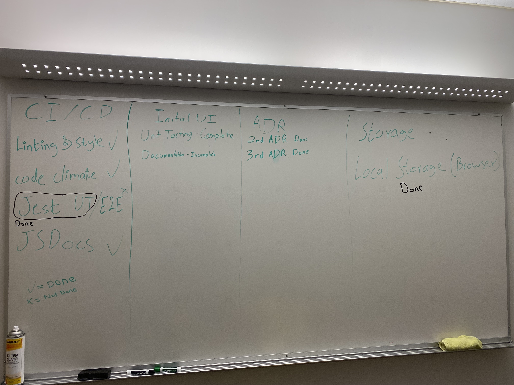

# 11/30/22 - Sprint 2

## Time and Location

- at 6:00 PM Wednesday Nov 30th, 2022

## Attendees
- Owen
- Rudy
- Regan
- Aleksa
- Michael
- Tim 
- Jerry (Remote)
- John (Remote)

## Progress Report
- CD/CI
  - Linting and Styling Done
  - Code limate
  - Jest UT - Done
  - JS Docs - Done
  - End to End Testing - Not Started
- UI
  - Unit Testing - Done
  - Documentation - (Almost) Done
  - Functionaliy - Done
- ADR
  - Second ADR - Done
  - Third ADR - Done
- Other
  - Local Storage - Done (Not Feasible)

  