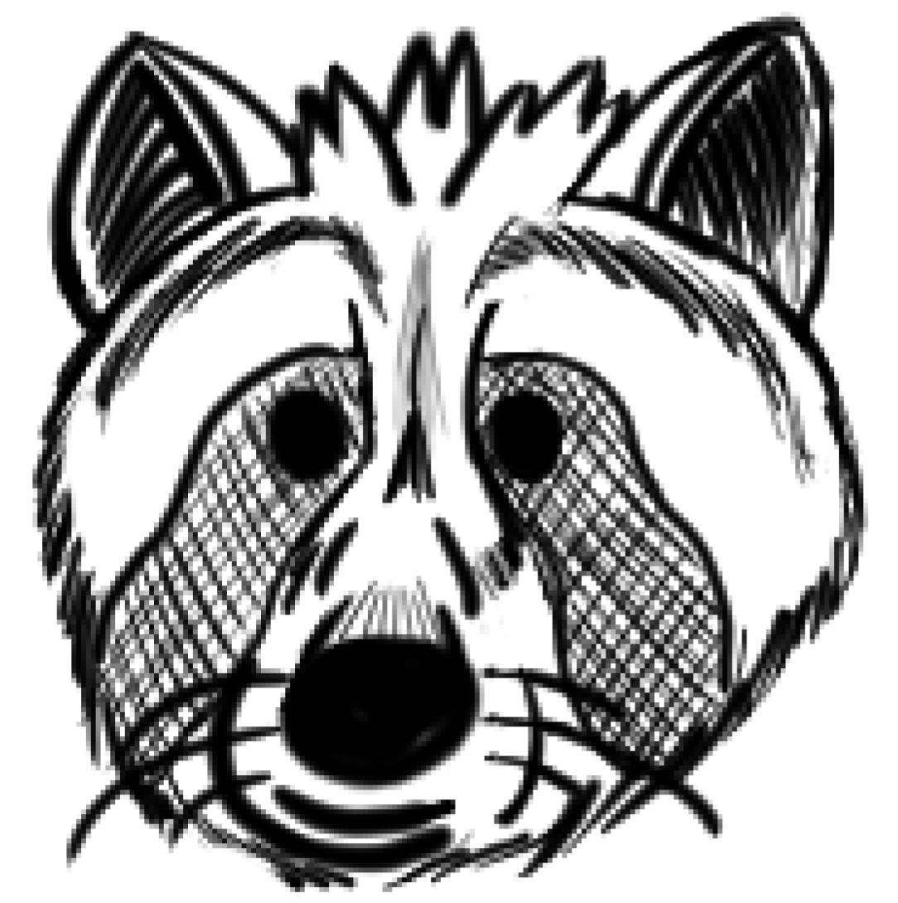

# **RESTful Raccoons**

## Who are we?
The RESTful Raccoons team is all about RACCOONS. Like Raccoons, we have big IQs, active only at night, and are 
adaptable to any situation life throws at us.  

## Roster

- [Aleksa Stamenkovic](https://github.com/a-stam) - UI/UX Designer
  >
- [Alex Gasca Rosas](https://github.com/wgascarosas) - Team Planner
  > I am a 2nd year transfer from San Francisco, I love to travel whenever I can and am fluent in 3 languages but can understand 5.
- [Jerry Xu](https://github.com/jerry-xu0514) - Member
  > I am a 2nd-year computer science major. I enjoy badminton, dancing, and having fun. I imagine my role in the team to be a facilitator, someone who the team can count on making the team feel like a team.
- [John Liu](https://github.com/3rr0r51)
  > A 20 year old tech enthusiasts who likes to build and code things, but likes to break it more. Also has a really chill sense of humor
- [Michael Tedjo](https://github.com/hulend) - Creative Lead
  > I'm a 4th year math-cs major that likes video games; acting as the creative lead. Totes.
- [Owen Pan](https://github.com/owen-ucsd) - Co-Lead
  > I'm a 3rd year Computer Engineering major who drinks way too much boba.
- [Regan Yang](https://github.com/SideCoin) - Member
  > I'm a 3rd year Cogs-ML major who enjoys running it down in video games. 
- [Rudy Orahin](https://github.com/rorahin) - Co-Lead
  > I am a 4th-year computer science major. I like playing chess, and my favorite part of the day is trying out different types of cuisine and dishes, I am obsessed with chess.
- [Timothy Wu](github.com/Tim-404)3rd year math-cs major, I like playing tennis and guitar. I prefer backend stuff
  >
- [Xiaofan Mu](https://github.com/mu-xiaofan)
  >
- [Gagan Gopalaiah](https://github.com/ggopalai) - Team TA
