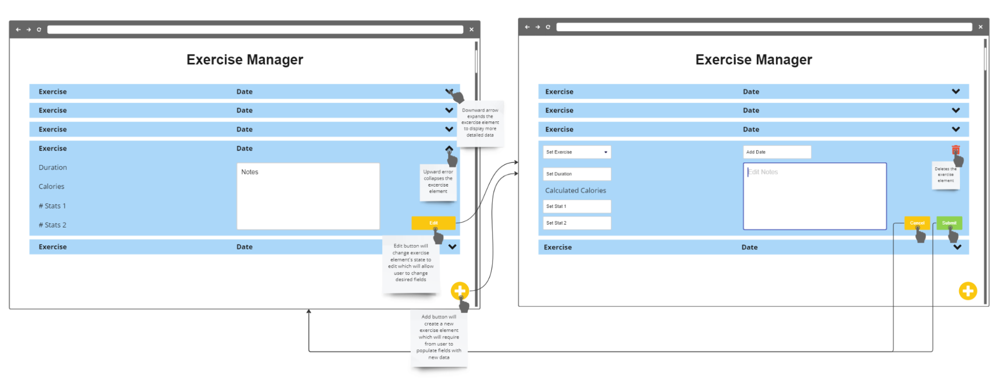
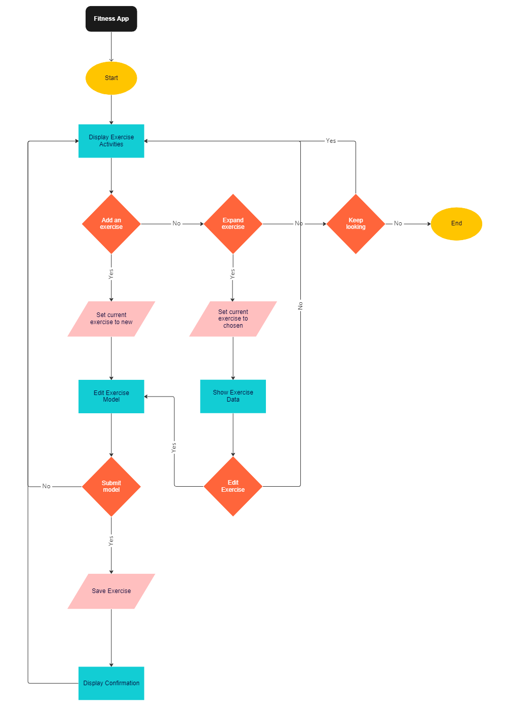

# App Pitch: FITNESS APP

## Summary
The app allows users to journal their exercise activities and track their firness progress.
Users can add past exercises they've completed or plan for upcoming exercises they'd like to do.
They can also edit edit/delete logs for existing exercises.
Each exercise will have sections for name, date, exercise stats, and side notes. The exercise stats that the user can fill out will vary depending on the exercise that is selected.
For example, if the user logs a jogging exercise, the associated stats would be time and distance. If the exercise is something like push-ups, the stats would become sets and repetitions.

Fitness apps tend to be heavyweight (pun intended), and the excessive features may be inconvenient.
This app provides a convenient way for anyone to track their fitness progress.
Logging and reviewing exercises should be easy and intuitive.
If you already know what exercise plan you want to follow through with and simply want to track your progress, this app is for you.

## CRUD
- Create: Users log past exercises and plan for future exercises
- Read: Users view the list of their exercises and progress details
- Update: Users update their past/planned exercises with statistics
- Delete: Users can delete any exercises they've added

## Visual Representation
[Miro board](https://miro.com/app/board/uXjVPJ9wDyY=/)

## User Examples
### Taylor
- Bio:
  - Works out every morning before work
- Goals: 
  - Maintain his current body shape/lifestyle
  - Track how many reps, calories, etc. from his exercises
- Problems:
  - Dislikes bloated fitness apps since he already knows what he needs to do
- How does our app solve their problem?
  - Taylor can easily log whatever exercise stats he wants to track and add/change them as he sees fit. He can also plan future workout sessions without any hassle.

### Jonathan
- Bio:
  - Started going to the gym in hopes of getting fit and impressing girls
  - Enjoys going to parties and doing athletic activities
- Goals: 
  - Get toned and fit
  - Get a girlfriend
- Problems:
  - Not sure what exercises are available
  - Can’t remember what exercises he did previously
- How does our app solve their problem?
  - The list of exercises the app provides can help narrow down which exact exercises Jonathan wants to do. Then, he’ll be able to look back and see what exercises he’s done in the past and their details (reps, time, etc.).

### Joanna
- Bio:
  - Started to workout recently
  - Hardworking student majoring in Biology
- Goals:
  - Work out consistently on a regular schedule
- Problems:
  - Cares about daily nutrition
  - Has trouble following through with her plans
- How does our app solve their problem?
  - Joanna can log her daily calories with each exercise to track her progress. She can also use the app to plan for future exercises, encouraging her to stick to a regular workout schedule.

## Risks and Considerations
### Technical
- **Spaghetti code from messy JavaScript**
  - *Just get good*
  - Can be mitigated by documentation
- **Learning how to use mySQL for local storage**
  - Accept that mistakes will be made, and go back and make changes as the project progresses
  - How should the data be structured? If we add a new feature, will that require us to store the data in a different format (e.g. optional fields)?
- **Different exercises should have different stats associated with them**
  - For example, running tracks time and distance while push-ups track sets and reps
  - The way we store data into mySQL and the HTML CSS layout have to account for these differences in exercises
  - If conditional layouts for different exercises are too complicated, we can take advantage of the optional fields mentioned above, considering user experience and interface
- **Authentication: do users need to login to access their workouts?**
- **The order of displaying workouts**
  - Upcoming/past exercises vs. completed/not completed?
  - Within each section: recently viewed vs. alphabetical order vs. custom order (if simple enough)?
  - What happens if an upcoming exercise is skipped? Does it still get displayed in the upcoming section even though the date has passed, or would it be displayed in the past section and marked as incomplete?
    - Marking as incomplete is an added feature not previously discussed, but it also doesn’t seem too complicated to do

### Communication
- Overly dependent on one person for coding/leading/etc.
- Not everyone is on the same page about how the project should look, function, etc.
  - Stay elaborate on standup meetings using Geekbot

### Design
- **Minimum (must implement)**
  - List of exercises
  - Dynamically changing input form dependent on a preselected list of exercises
    - For example, input names should change from “miles” to “reps” when we change from jogging to push-ups
    - The number of input forms should be kept as small as reasonable (to avoid feature creep)
  - Each exercise should collect multiple details
- **Target (implement once we get the chance)**
  - Summary of stats
  - Responsive UI for a standard desktop and phone
    - Priority should be given to a 16:9 aspect ratio for computers
    - Can design alternate UI for phones (9:20) and use window boxing to fill in for other aspect ratios
  - Daily/weekly goals and progress toward these goals
- **Reach (extra stuff that would be cool to add)**
  - Custom exercises
    - User can create their own exercises with specific stats that they want to record.
  - Include media (photo or short video)
    - Show what the exercise looks like
    - Links to YouTube videos probably
  - Exercise recommender system
  - Social media sharing